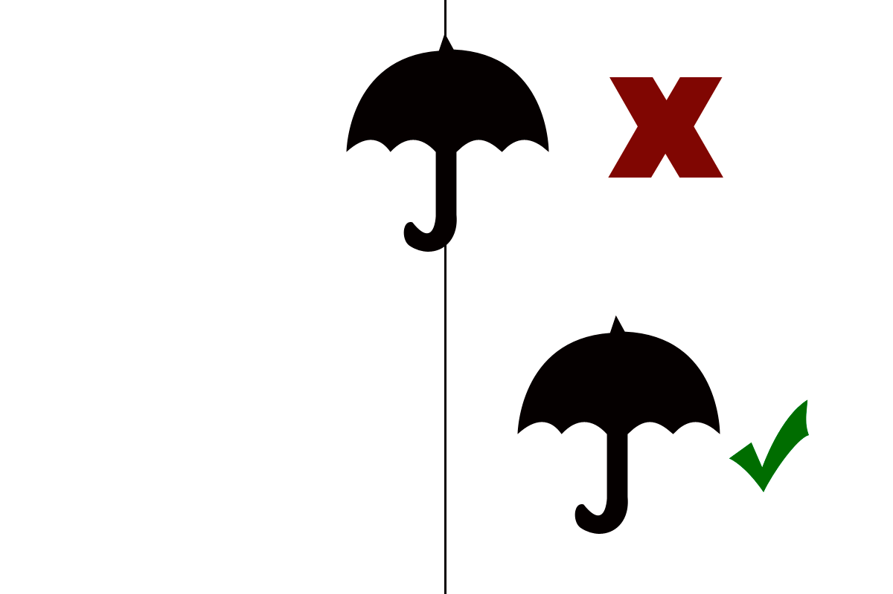

# Photography Tips and Tricks

The tips below focus on the art of composition, follow these to improve your photographic techniques

## Rule of Thirds

* Follow the rule of thirds by enabling the grid on your phone's camera and make sure that the subject in focus is placed on the following points as shown in the image.

Focus Image should be placed on either of the red dots.

* Image should either be placed on the bottom 1/3 or the top 2/3 of the camera (**Tip** - Use the Grid feature of the camera)

* Focus image should never be centered on the camera and should be placed on either right or the left from the center.

* **Straighten the Horizon** - Use the balance bar (or the grid in case the camera does not have a balance bar) to make sure that the horizon is kept straight. A tilted photograph gives the user an unsettling feeling.

* Always make sure that the number of subjects are always odd as the eyes always focus on odd number of individuals.

* **Placement of Light** - A camera should never be facing the light source as it would result in dark and under exposed images. Make sure that the light source is always behind the camera.

* **Shadows** - Make sure that the shadows do not fall at odd points, the image should not contain your shadow. 

* **Background** - Background play a very crucial part as they give the images a sense of depth and helps them gain focus. Make sure that the bacground is always neutral and does not contain any pattern.

* **Perspective** - Always give your subject some perspective so that they don't stand out flat.

* Do not use the camera zoom of your phone as they use digital zoom which makes the images blurry.

* **Post-Processing** - Use software like Lightroom (preferably) or Photoshop to touch up your images.